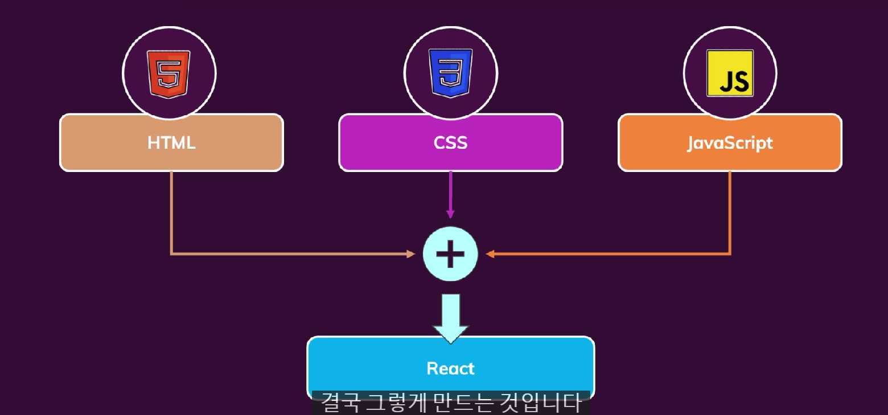
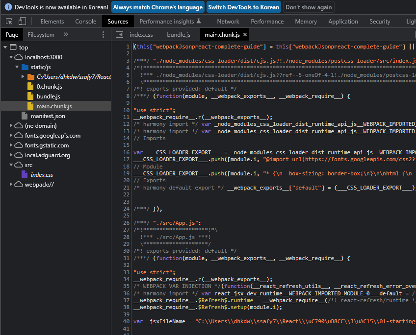

[TOC]


# 0620

## 리액트란

- 자바스크립트 라이브러리
- 넷플릭스 페이지
- 웹사이트 써도 모바일 웹쓰는것과 같은 느낌
- 기존의 웹사이트들은 요청을 보내고 HTML Page를 받는 식으로 진행됨
  - 약간 무거웠다.
  - html 페이지가 로딩되는 동안 기다려야 했음
- 자바스크립트의 이점
  - 사용자들이 보는 것을 조작할 수 있음 = DOM
  - 새로운 html 페이지를 가져오지 않아도 다른 것들을 보여줄 수 있다.
- 리액트는 자바스크립트에 추가로 더해주는 것

## 왜 자바스크립트 대신 리액트?

- 자바스크립트는 일일이 다 설정해줘야한다.
- 예를들어 TODO list 페이지
- 클릭에는 모든 단계들이 전부 설명되어야 한다.
- 이런 프로그래밍 방식을 명령형 접근방식이라 한다.
- 버튼을 생성하고 텍스트 컨텐츠를 설정하기 위해서 저수준의 코드를 실행해야한다.
  - 이는 계속 반복된다.


- 리액트에서는 컴포넌트가 중요

- 자바스크립트 처럼 코드가 절차적으로 많이 않음

- 리액트를 활용해서 복잡한 사용자 인터페시드 작업을 쉽게 구축할 수 있다.

- 고수준의 코드를 사용해서 선언형 접근방식의 코드를 작성할 수 있다.

  

## 리액트로 단일페이지 애플리케이션 구축하기

- 위젯만 리액트로 관리할 수 있지만 전체 페이지를 리액트로 관리할 수 있음
- 가령 넷플릭스의 경우 영화를 클릭하면 페이지가 이동한 것 같지만 html 요청이 이루어지지 않았음
  - 이는 자바스크립트를 사용한 것임


## 리액트의 대안 탐색하기 (Aungular/ Vue)

- 리액트는 컴포넌트에만 집중하고 있음
- 라우팅을 하는 경우 서드파티를 설치해야함


- 앵글러는 리액트랑 비슷한 컴포넌트 중심
- 프레임워크에 많은것이 내장되어 있음

- 뷰는 앵글러랑 리액트 합친 느낌
- 기능은 앵글러>뷰>리액트
- 라우팅 포함되어 있음
- 앵글러만큼 과부하되지 않음

## 강의소개


## 강의에서 얻는법


# 0621

## 화살표 함수

```js
function printName(name){
	console.log(name);
}

printName()

const printName = (name) =>{
	console.log(name)
}

const multifly = number => number *2;
console.log(multifly(2))
// 인수가 한개인 경우 괄호도 삭제가능
// return 생략 가능
```


## Export & Imports (Modules)

```js
//person.js

const person = {
	name:Max
}

export default person
```

- 어딘가에 객체를 import 할 수 있음

```js
//utility.py

export const clean = () => {...}
export const baseData = 10;
```

```js
//app.js

import person from './person.js'
import prs from './person.js'

import {baseData} from './utility.js'
import {clean} from './utility.js'
```


## Classes

```js
class Person{
	name = 'Max'
	call = () => {...}
}
```

- 메소드
  - 클래스에 정의한 함수
- 프로퍼티
  - 클래스에 정의한 변수

```js
const myPerson = new Person()
myPerson.call()
console.log(myPerson.name)
```

- 생성자 사용

```js
class Person extends Master
```

- 다른 클래스에 있는 프로퍼티와 메소드를 상속하면 새로운 프로퍼티와 메소드를 추가한다는 뜻

- 예시

```js
class Human{
    constructor(){
        this.gender = 'male';
    }
    printGender(){
        console.log(this.gender)
    }
}


class Person extends Human{
	constructor(){
        super();
        this.name = 'Max';
        //this.gender = 'female' //female 출력
    }
    printMyName(){
        console.log(this.name);
    }
}
const person = new Person();
person.printMyName(); //Max
preson.printGender();// male // female
```


## Classes, Properties & Methods

- 위에꺼는 구식
- 차세대 자바스크립트

```js
class Human{

        gender = 'male';

    printGender = () => {
        console.log(this.gender)
    }
}


class Person extends Human{


        name = 'Max';
        gender = 'female' //female 출력

    printMyName = () => {
        console.log(this.name);
    }
}
const person = new Person();
person.printMyName(); //Max
preson.printGender();// male // female
```


## Spread & Rest Operations

`...`

- 배열의 원소나 객체의 프로퍼티를 나누는데 사용됨
- 그래서 배열이나 객체를 펼처 놓음

```js
const newArray = [...oldArray, 1,2]
const newObject = [...oldObject, newProp:5]


const numbers = [1,2,3]
const newNumvers = [numbers, 4] // = [[1,2,3],4]
const newNumvers = [...numbers, 4] // = [1,2,3,4]
```

- 객체의 경우

```js
const person = {
    name: 'Max'
};
const newPerson = {
    ...person,
    age: 28
}
console.log(newPerson) 
<!-- 

[object Object]{
	age:28,
    name: 'Max'
} 
--!>

```


### 구조 분해 할당

```js
const numbers = [1,2,3];
[num1, num2] = numbers;
console.log(num1. num2); // 1,2

[num, ,num3] =numbers;
console.log(num1,num3); //1,3
```


### 참조형 및 원시타입

```js
const number = 1; //기본형
const num2 =number; //복사한것임 참조형 

console.log(num2); //1
```

```js
const person = {
    name: 'max';
}

const secondPerson = person;
console.log(secondPerson) 
/* 
[object Object]{
    name: 'max'
}
*/

person.name = 'manu'
console.log(secondPerson) 

/* 
[object Object]{
    name: 'manu'
}
*/


```


### 배열함수

- map,fillter 등등


## What is components

- React is all about components
- why component is important?
  - 모든 인터페이스들은 모두 컴포넌트로 구성되있기 때문에
  - 컴포넌트는 html, css 어떤 로직을 위한 자바스크립트의 결합
  - 재사용 가능성
    - 반복을 피해줌
  - 우려사항등을 분리할 수 있도록 해주어서
    - 작은 단위로 케어가능


## How is A Component Bulit



- 리액트는 선언형 명령
- 자바스크립트 처럼 일일히 지정해주지 않아도 된다.(DOM)
- 최종 상태와 어떤 상태가 사용되어야 하는지 정의하면 된다.


## start react

```bash
npx create-react-app my-app
cd my-app
npm start
```

- 압축을 푼 폴더에서 react를 실행하고 싶은 경우에는
  - npm install 로 패키지에 필요한 것들을 모두 설치


### 표준 리액트 분석하기

```react
//index.js

import ReactDOM from 'react-dom';

import './index.css';
import App from './App';

ReactDOM.render(<App />, document.getElementById('root'));


/*기존의 js의 경우 실행이 되지 않았을 코드들*/
```

- App은 컴포넌트
- 'root'에서 렌더링함
  - root는 index.html에 div로 있음 `<div id="root"><div>`

```react
//App.js

function App() {
  return (
    <div>
      <h2>Let's get started!</h2>
      <h4>김진행</h4>
    </div>
  );
}

export default App;

```

- 자바스크립트 안에있는 html 파일을 return함
- jsx라는 파일로 가능케 되는 것

### jsx란



- 리액트 실행케 해주는 파일들


### 리액트 작동 방식

### 첫번째 컴포넌트만들기

- src에 components 폴더 만들고 안에 ExpensItem.js 파일 만들기
- 컴포넌트는 단지 자바스크립트 함수일 뿐임

```react
//src\components\ExpenseItem.js

function ExpensItem() {
  return <h2>Expens item!</h2>
}

export default ExpensItem
```

- export 로 함수를 내보내기

```react
//App.js

import ExpensItem from "./components/ExpenseItem"; //html 요소로 사용 가능

function App() {
  return (
    <div>
      <h2>Let's get started!</h2>
      <h4>김진행</h4>
      <p>cscsc</p>
      <ExpensItem></ExpensItem> ################################
    </div>
  );
}

export default App;

```

```react
function ExpensItem() {
  return (
    <div>
      <h2>리액티</h2>
      <li>1<ul>2222</ul></li>
    </div>
  );
}

export default ExpensItem;

```

- 더쓰고 싶은 경우 이렇게
  - shift + alt + f 누르면 정렬됨


### 기본 css 추가

- components 폴더에 
  - ExpenseItem.css 작성

```react
//ExpenseItem.js

import './ExpenseItem.css'; // css 임포트


function ExpensItem() {
  return (
    <div className='expense-item'>
      <div >Date</div>
      <div className='expense-item__descripton'>
        <h2>Car Insurance</h2>
        <div className='expense-item__price'>$245.6</div>
      </div>
    </div>
  );
}

export default ExpensItem;

```


### JSX 에서 동적 데이터 출력 및 표현식 작업하기

```react
//ExpenseItem.js

import './ExpenseItem.css';


const date = new Date();
const expenseItem = 'Car Insurance';
const expenseAmount = 294.7; 

function ExpensItem() {
  return (
    <div className='expense-item'>
      <div >{date.toISOString()}</div>
      <div className='expense-item__descripton'>
        <h2>{expenseItem}</h2>
        <p>{Math.random()}</p>
        <div className='expense-item__price'>${expenseAmount}</div>
      </div>
    </div>
  );
}

export default ExpensItem;

```

- `{ }` 을 사용해서 동적 방식으로 데이터 출력 가능


### props를 통해 데이터 전달하기

```react
//Apps.js

import ExpensItem from "./components/ExpenseItem";

function App() {
  const expenses = [
    {
      id: "e1",
      title: "Toilet Paper",
      amount: 94.12,
      date: new Date(2020, 7, 14),
    },
    { id: "e2", title: "New TV", amount: 799.49, date: new Date(2021, 2, 12) },
    {
      id: "e3",
      title: "Car Insurance",
      amount: 294.67,
      date: new Date(2021, 2, 28),
    },
    {
      id: "e4",
      title: "New Desk (Wooden)",
      amount: 450,
      date: new Date(2021, 5, 12),
    },
  ];
  return (
    <div>
      <ExpensItem
        title={expenses[0].title}
        amount={expenses[0].amount}
        date={expenses[0].date}
      ></ExpensItem>
      <ExpensItem
        title={expenses[1].title}
        amount={expenses[1].amount}
        date={expenses[1].date}
      ></ExpensItem>
      <ExpensItem
        title={expenses[2].title}
        amount={expenses[2].amount}
        date={expenses[2].date}
      ></ExpensItem>
      <ExpensItem
        title={expenses[3].title}
        amount={expenses[3].amount}
        date={expenses[3].date}
      ></ExpensItem>
    </div>
  );
}

export default App;

```

```react
//ExpenseItem.js

import './ExpenseItem.css';


function ExpensItem(props) {
  return (
    <div className='expense-item'>
      <div >{props.date.toISOString()}</div>
      <div className='expense-item__descripton'>
        <h2>{props.title}</h2>
        <div className='expense-item__price'>${props.amount}</div>
      </div>
    </div>
  );
}

export default ExpensItem;

```

- 매개변수 props 하나만을 받아서 사용
  - props.title, props.amount 등
- Apps.js 에서 데이터는 배열로 줌
- props는 재사용가능하게 해주고, 데이터를 props 끼리 이동시킬 수 있음
